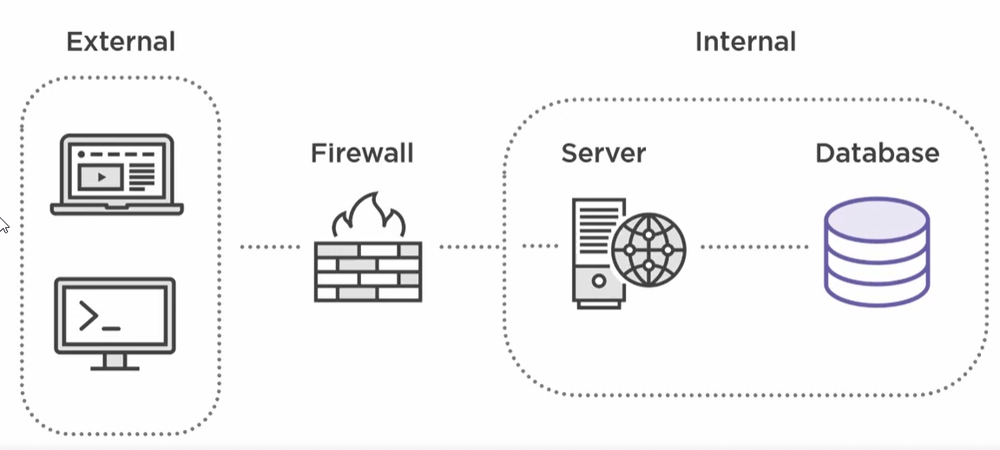
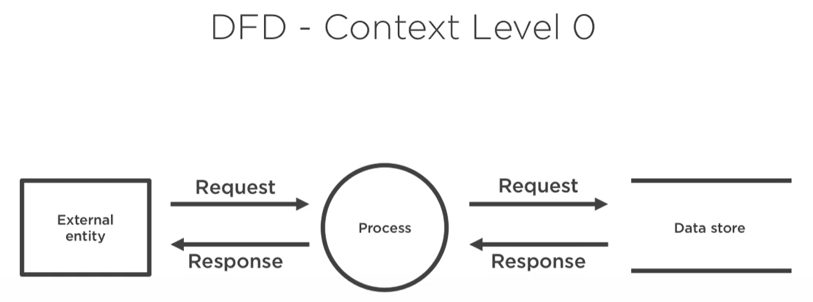
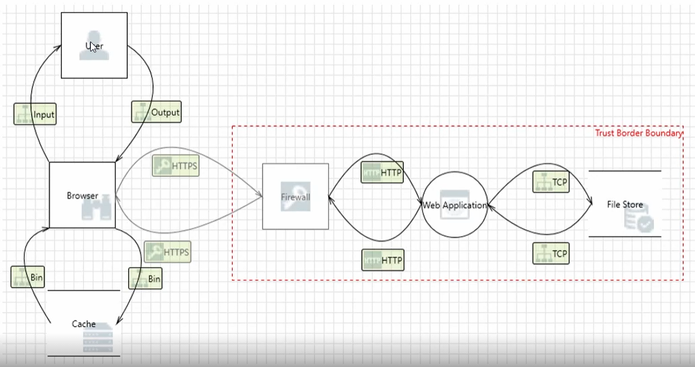

# Thread modeling using Microsoft Threat Modeling Tool

## Application review

* users: who the users will be
* use cases: what the users are trying to do
* technology: tech. stack

### Sample application review

**Application for sharing documents between CompanyX and external client and partners:**

* users: user and roles include normal employees and also external client and partners - we do not know what kind of documents might be shared

* use case: securely share electronics documents with clients

* stack: Microsoft technology stack

## Architecture review 



## Data flow diagrams





## Templates

To create copy of template:

* go to create new template and copy author name
* close previous window and click open template
  * copy and rename template that you want based on (tb7 file)
  * next update section 
    ```xml
    <Manifest name="SDL TM Knowledge Base (Core)" id="cc62ebae-3748-431e-b1df-f4220dc9003f" version="4.1.0.11" author="TwC MSEC" />
    ```
    paste your user name into author field.

# resources
https://app.pluralsight.com/library/courses/threat-modeling-with-microsoft-threat-modeling-tool-2016/table-of-contents   
https://docs.microsoft.com/en-us/azure/security/develop/threat-modeling-tool   
